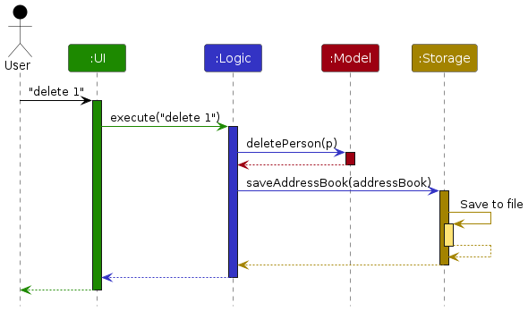
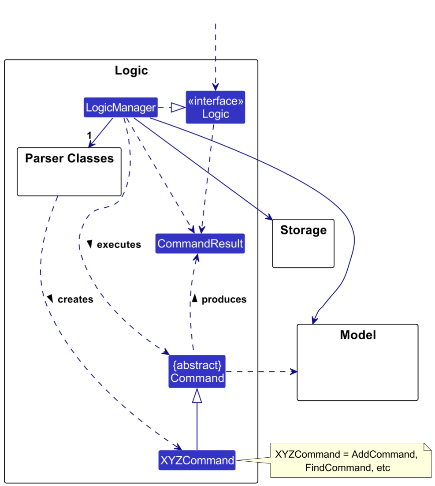
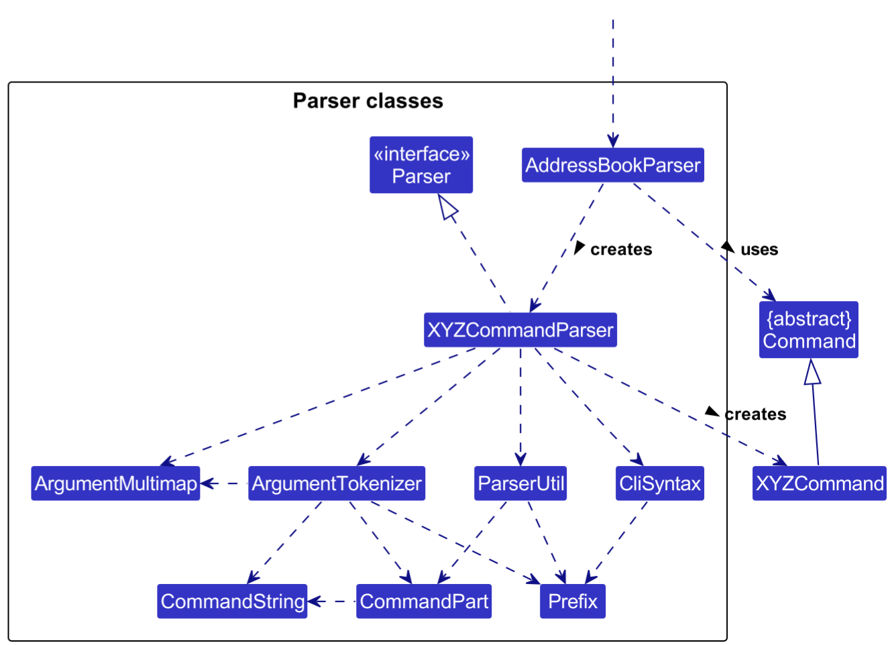
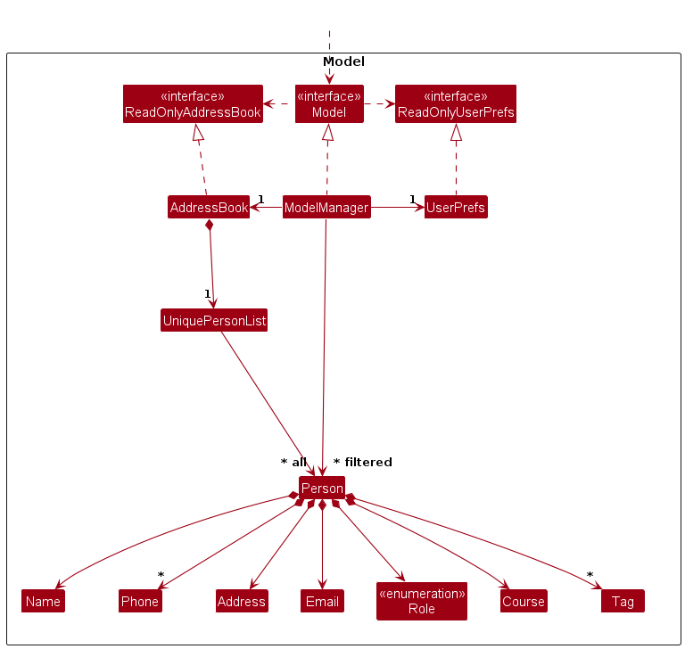
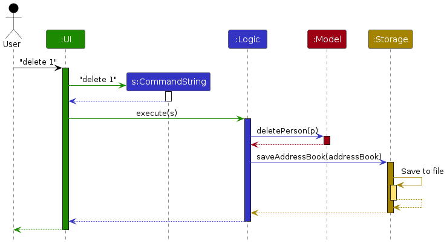
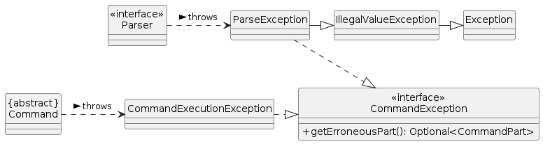

* Table of Contents
{:toc}

--------------------------------------------------------------------------------------------------------------------

## **Acknowledgements**

* This project is based on the AddressBook-Level3 project created by the [SE-EDU initiative](https://se-education.org).
* Several features was inspired from common programs and/or other CS2103/T teams projects features.

--------------------------------------------------------------------------------------------------------------------

## **Setting up, getting started**

Refer to the guide [_Setting up and getting started_](SettingUp.md).

--------------------------------------------------------------------------------------------------------------------

## **Design**

:bulb: **Tip:** The `.puml` files used to create diagrams in this document `docs/diagrams` folder. Refer to the [_PlantUML Tutorial_ at se-edu/guides](https://se-education.org/guides/tutorials/plantUml.html) to learn how to create and edit diagrams.

### Architecture

The ***Architecture Diagram*** given above explains the high-level design of the App.

Given below is a quick overview of main components and how they interact with each other.

**Main components of the architecture**

**`Main`** (consisting of classes [`Main`](https://github.com/AY2324S2-CS2103T-T11-2/tp/tree/master/src/main/java/seedu/address/Main.java) and [`MainApp`](https://github.com/AY2324S2-CS2103T-T11-2/tp/tree/master/src/main/java/seedu/address/MainApp.java)) is in charge of the app launch and shut down.
* At app launch, it initializes the other components in the correct sequence, and connects them up with each other.
* At shut down, it shuts down the other components and invokes cleanup methods where necessary.

The bulk of the app's work is done by the following four components:

* [**`UI`**](#ui-component): The UI of the App.
* [**`Logic`**](#logic-component): The command executor.
* [**`Model`**](#model-component): Holds the data of the App in memory.
* [**`Storage`**](#storage-component): Reads data from, and writes data to, the hard disk.

[**`Commons`**](#common-classes) represents a collection of classes used by multiple other components.

**How the architecture components interact with each other**

The *Sequence Diagram* below shows how the components interact with each other for the scenario where the user issues the command `delete 1`.

:information_source: **Note:**
The description is a high-level description and is not exactly accurate, for example,
the `execute()` method in fact takes in a `CommandString` object that represents a command string,
instead of a literal string.

Each of the four main components (also shown in the diagram above),

* defines its *API* in an `interface` with the same name as the Component.
* implements its functionality using a concrete `{Component Name}Manager` class (which follows the corresponding API `interface` mentioned in the previous point.

For example, the `Logic` component defines its API in the `Logic.java` interface and implements its functionality using the `LogicManager.java` class which follows the `Logic` interface. Other components interact with a given component through its interface rather than the concrete class (reason: to prevent outside component's being coupled to the implementation of a component), as illustrated in the (partial) class diagram below.

The sections below give more details of each component.

### UI component

The **API** of this component is specified in [`Ui.java`](https://github.com/AY2324S2-CS2103T-T11-2/tp/tree/master/src/main/java/seedu/address/ui/Ui.java)

The UI consists of a `MainWindow` that is made up of parts e.g.`CommandBox`, `ResultDisplay`, `PersonListPanel`, `StatusBarFooter` etc. All these, including the `MainWindow`, inherit from the abstract `UiPart` class which captures the commonalities between classes that represent parts of the visible GUI.

The `UI` component uses the JavaFx UI framework. The layout of these UI parts are defined in matching `.fxml` files that are in the `src/main/resources/view` folder. For example, the layout of the [`MainWindow`](https://github.com/AY2324S2-CS2103T-T11-2/tp/tree/master/src/main/java/seedu/address/ui/MainWindow.java) is specified in [`MainWindow.fxml`](https://github.com/AY2324S2-CS2103T-T11-2/tp/tree/master/src/main/resources/view/MainWindow.fxml)

The `UI` component,

* executes user commands using the `Logic` component.
* listens for changes to `Model` data so that the UI can be updated with the modified data.
* keeps a reference to the `Logic` component, because the `UI` relies on the `Logic` to execute commands.
* depends on some classes in the `Model` component, as it displays `Person` object residing in the `Model`.

### Logic component

**API** : [`Logic.java`](https://github.com/AY2324S2-CS2103T-T11-2/tp/tree/master/src/main/java/seedu/address/logic/Logic.java)

Here's a (partial) class diagram of the `Logic` component:

The sequence diagram below illustrates the interactions within the `Logic` component, taking `execute("delete 1")` API call as an example.

:information_source: **Note:** The lifeline for `DeleteCommandParser` should end at the destroy marker (X) but due to a limitation of PlantUML, the lifeline continues till the end of diagram.

How the `Logic` component works:

1. When `Logic` is called upon to execute a command, it is passed to an `AddressBookParser` object which in turn creates a parser that matches the command (e.g., `DeleteCommandParser`) and uses it to parse the command.
1. This results in a `Command` object (more precisely, an object of one of its subclasses e.g., `DeleteCommand`) which is executed by the `LogicManager`.
1. The command can communicate with the `Model` when it is executed (e.g. to delete a person). 
   Note that although this is shown as a single step in the diagram above (for simplicity), in the code it can take several interactions (between the command object and the `Model`) to achieve.
1. The result of the command execution is encapsulated as a `CommandResult` object which is returned back from `Logic`.

Here are the other classes in `Logic` (omitted from the class diagram above) that are used for parsing a user command:

:information_source: **Note:**
Several other components (`XYZCommandParser`, and `CommandBox` in [`UI` component](#ui-component))  also depends on `CommandPart`
to indicate which part of the command causes the error,
however to avoid cluttering the diagram, the dependency is not shown.

How the parsing works:
* When called upon to parse a user command, the `AddressBookParser` class creates an `XYZCommandParser` (`XYZ` is a placeholder for the specific command name e.g., `AddCommandParser`) which uses the other classes shown above to parse the user command and create a `XYZCommand` object (e.g., `AddCommand`) which the `AddressBookParser` returns back as a `Command` object.
* All `XYZCommandParser` classes (e.g., `AddCommandParser`, `DeleteCommandParser`, ...) inherit from the `Parser` interface so that they can be treated similarly where possible e.g, during testing.

### Model component
**API** : [`Model.java`](https://github.com/AY2324S2-CS2103T-T11-2/tp/tree/master/src/main/java/seedu/address/model/Model.java)

The `Model` component,

* stores the address book data i.e., all `Person` objects (which are contained in a `UniquePersonList` object).
* stores the currently 'selected' `Person` objects (e.g., results of a search query) as a separate _filtered_ list which is exposed to outsiders as an unmodifiable `ObservableList<Person>` that can be 'observed' e.g. the UI can be bound to this list so that the UI automatically updates when the data in the list change.
* stores a `UserPref` object that represents the user’s preferences. This is exposed to the outside as a `ReadOnlyUserPref` objects.
* does not depend on any of the other three components (as the `Model` represents data entities of the domain, they should make sense on their own without depending on other components)

:information_source: **Note:** An alternative (arguably, a more OOP) model is given below. It has a `Tag` list in the `AddressBook`, which `Person` references. This allows `AddressBook` to only require one `Tag` object per unique tag, instead of each `Person` needing their own `Tag` objects. 

### Storage component

**API** : [`Storage.java`](https://github.com/AY2324S2-CS2103T-T11-2/tp/tree/master/src/main/java/seedu/address/storage/Storage.java)

The `Storage` component,
* can save both address book data and user preference data in JSON format, and read them back into corresponding objects.
* inherits from both `AddressBookStorage` and `UserPrefStorage`, which means it can be treated as either one (if only the functionality of only one is needed).
* depends on some classes in the `Model` component (because the `Storage` component's job is to save/retrieve objects that belong to the `Model`)

### Common classes

Classes used by multiple components are in the `seedu.address.commons` package.

--------------------------------------------------------------------------------------------------------------------

## **Implementation**

This section describes some noteworthy details on how certain features are implemented.

### Highlight error feature

This feature would automatically highlight (select) the part of the command that contains the error in the command box,
so that the user can edit it more quickly.

For example, if the user type `edit 1 p/12 c/CS2103T`, since the phone number is invalid (but the course code `CS2103T` is valid), then `12` will be highlighted, which speeds up the process of data entry because the user no longer have to press `[←]` several times to navigate to `12`.

#### Implementation

First, many functions that originally takes the command string, will now take `CommandString`, which is a class
containing a string.

Compare the old and the new sequence diagram below for the execution of a command. This is the old sequence diagram.

And this is the new sequence diagram.

A class `CommandPart` is used to maintain a part of a command. For example, if `s` is a `CommandString` with value `edit 1 p/12 c/CS2103T`, then `new CommandPart(s).substring(9, 11)` returns a `CommandPart` whose `toString()` representation is `12`, but it also remembers the index into the original `CommandString` object.

Then, `ParseException` and `CommandExecutionException` are two exception classes that implements the `CommandException`
interface. A `CommandException` has an `getErroneousPart()` method that returns an `Optional<CommandPart>`.

When the UI catches a `ParseException` or `CommandExecutionException`, it will call `getErroneousPart()` on the
exception object. If the result is not `Optional.empty()`, it will select the corresponding part in the command box.

Various methods in the parser and the command executor is modified to include the correct command part.

For backwards compatibility, not all `CommandException` object need to know what part of the command causes the error.

#### Design considerations

**Aspect: How to represent a command string:**

* **Alternative 1 (current choice):** Name the class `CommandString`.

**Aspect: How to represent a part of the command string:**

* **Alternative 1 (current choice):** Name the class `CommandPart`, and make it specifically only represent a part of a
  command.
  * Pros: Descriptive class name.
  * Cons: See the pros of alternative 2.
* **Alternative 2:** Name the class `StringPart` or equivalent, and make it represent a part of *any* string.
  * Pros: Later if the need to maintain a substring with reference to the original string shows up in another part of
    the code, the class can be reused.
  * Cons: See the pros of alternative 1.

**Aspect: How to implement common `getErroneousPart()` method for the exception classes:**

* **Alternative 1 (current choice):** Make an interface `CommandException`, which exposes `getErroneousPart()`.
  * Pros: Caller can call `getErroneousPart()` without checking and casting it to `CommandExecutionException` to
    `ParseException`.
  * Cons: Ambiguous semantic. There's no guarantee a class implementing `CommandException` also extends `Exception`.

* **Alternative 2:** Make an abstract class `CommandException`, and make both classes inherit from that.
  * Pros: Allows a common implementation for `getErroneousPart()` without duplicating the code across classes.
  * Pros: Allows code to write `catch (CommandException e)` instead of `catch (ParseException | CommandExecutionException
    e)`.
  * Cons: `ParseException` already inherit from `IllegalValueException`, and Java does not allow diamond inheritance.

* **Alternative 3:** Same as alternative 2, but make `ParseException` no longer inherit from `IllegalValueException`.
  * Pros: Same as in alternative 2.
  * Cons: Breaks backwards compatibility, because some part of the code may expect `catch (IllegalValueException)` to
    also catch a `ParseException`.

--------------------------------------------------------------------------------------------------------------------

## **Documentation, logging, testing, configuration, dev-ops**

* [Documentation guide](Documentation.md)
* [Testing guide](Testing.md)
* [Logging guide](Logging.md)
* [Configuration guide](Configuration.md)
* [DevOps guide](DevOps.md)

--------------------------------------------------------------------------------------------------------------------

## **Appendix: Requirements**

### Product scope

**Target user profile**:

* has a need to manage a significant number of contacts of NUS students, tutors, and professors
* prefer desktop apps over other types
* can type fast
* prefers typing to mouse interactions
* is reasonably comfortable using CLI apps

**Value proposition**:
* manage contacts faster than a typical mouse/GUI driven app
* allow NUS students to save and search up contacts of students/tutors/instructors and the courses they are in. (e.g. tutorial/lecture groupings)

### User stories

Priorities: High (must have) - `* * *`, Medium (nice to have) - `* *`, Low (unlikely to have) - `*`

| Priority | As a …​                                    | I want to …​                     | So that I can…​                                                                   |
|----------|--------------------------------------------|----------------------------------|-----------------------------------------------------------------------------------|
| `* * *`  | new user                                   | see usage instructions           | refer to instructions when I forget how to use the App                            |
| `* * *`  | user                                       | add a new tutor                  |                                                                                   |
| `* * *`  | user                                       | delete a tutor                   | remove entries that I no longer need                                              |
| `* * *`  | user                                       | find a tutor by name             | locate details of tutors without having to go through the entire list             |
| `* * *`  | user                                       | find a tutor by course code      | locate tutors from a specific course without having to go through the entire list |
| `* *`    | user                                       | edit a tutor                     | change incorrect or new information about a tutor                                 |

### Use cases

(For all use cases below, the **System** is the `NUSContacts` and the **Actor** is the `user`, unless specified otherwise)

**UC1: Add a tutor**

**MSS**

1.  User requests to add a tutor
2.  User provides the tutor's details
3.  NUSContacts adds the tutor

    Use case ends.

**Extensions**

* 2a. The tutor already exists.
    * 2a1. NUSContacts informs the user of the error.

      Use case ends.

**UC2: Delete a tutor**

**MSS**

1.  User requests to list tutors
2.  NUSContacts shows a list of tutors
3.  User requests to delete a specific tutor in the list
4.  NUSContacts deletes the tutor

    Use case ends.

**Extensions**

* 2a. The list is empty.

  Use case ends.

* 3a. The given index is invalid.

    * 3a1. NUSContacts shows an error message.

      Use case resumes at step 2.

**UC3: Edit a tutor**

**MSS**

1. User requests to edit a tutor
2. User provides the field to edit and the new value
3. NUSContacts edits the tutor

   Use case ends.

**Extensions**

* 2a. User provides an empty address for a PROFESSOR. 
    * 2a1. NUSContacts shows an error message.
      
      Use case resumes at step 2.
* 2b. User gives a tutor without an address the PROFESSOR role.
    * 2b1. NUSContacts shows an error message.
    
      Use case resumes at step 2.

**UC4: Find a tutor by name**

**MSS**

1.  User requests to find a tutor
2.  NUSContacts prompts search criterion (name or course code)
3.  User provides the search criterion (name)
4.  NUSContacts shows the tutor(s) that match the criterion

    Use case ends.

**Extensions**

* 4a. No tutor matches the criterion.
    * 4a1. NUSContacts informs the user of the error.

      Use case ends.

**UC5: Find a tutor by course code**

**MSS**

1.  User requests to find a tutor
2.  NUSContacts prompts search criterion (name or course code)
3.  User provides the search criterion (course code)
4.  NUSContacts shows the tutor(s) that match the criterion

    Use case ends.

**Extensions**

* 4a. No tutor matches the criterion.
    * 4a1. NUSContacts informs the user of the error.

      Use case ends.

### Non-Functional Requirements

1.  Should work on any _mainstream OS_ as long as it has Java `11` or above installed.
2.  Should be able to hold up to 1000 contacts without a noticeable sluggishness in performance for typical usage.
3.  A user with above average typing speed for regular English text (i.e. not code, not system admin commands) should be able to accomplish most of the tasks faster using commands than using the mouse.
4.  Error messages displayed to application window should be easily understood by most users.
5.  System should respond to user actions within 1 second.
6.  For databases with less than 1000 contacts, fetching and saving of contacts to/from it should not exceed 200 milliseconds.
7.  System should handle data corruption or loss without crashing the application.
8.  System architecture should support future updates and extensions without major restructures.
9.  System should support comprehensive testing for all components and features.

### Glossary

* **Mainstream OS**: Windows, Linux, Unix, MacOS
* **Private contact detail**: A contact detail that is not meant to be shared with others

--------------------------------------------------------------------------------------------------------------------

## **Appendix: Instructions for manual testing**

Given below are instructions to test the app manually.

:information_source: **Note:** These instructions only provide a starting point for testers to work on;
testers are expected to do more *exploratory* testing.

### Launch and shutdown

1. Initial launch

   1. Download the jar file and copy into an empty folder.

   1. Double-click the jar file. 
      Expected: Shows the GUI with a set of sample contacts. The window size may not be optimum.

1. Saving window preferences

   1. Resize the window to an optimum size. Move the window to a different location. Close the window.

   1. Re-launch the app by double-clicking the jar file. 
      Expected: The most recent window size and location is retained.

### Deleting a person

1. Deleting a person while all persons are being shown

   1. Prerequisites: List all persons using the `list` command. Multiple persons in the list.

   1. Test case: `delete 1` 
      Expected: First contact is deleted from the list. Details of the deleted contact shown in the status message. Timestamp in the status bar is updated.

   1. Test case: `delete 0` 
      Expected: No person is deleted. Error details shown in the status message. Status bar remains the same.

   1. Other incorrect delete commands to try: `delete`, `delete x`, `...` (where x is larger than the list size). 
      Expected: Similar to previous.

### Saving data

1. Dealing with missing/corrupted data files

   1. Close the application, and delete the data file (if it exists).

   2. Re-launch the application. 
      Expected: The data file is re-created and populated with sample data.

   3. Close the application, and modify the data to be invalid.

   4. Re-launch the application. 
      Expected: The program reports the data file is corrupted, and start with an empty address list.

   5. Add some entry into the address book. 
      Expected: The new data is saved into the save file.

