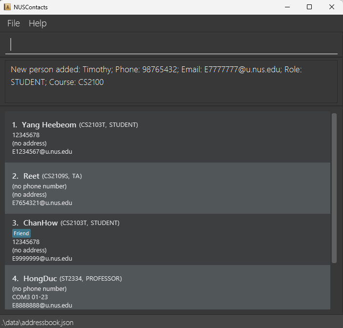
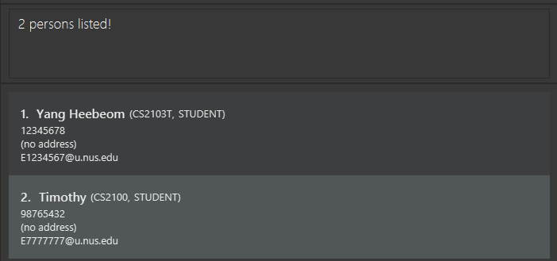
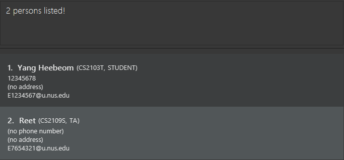
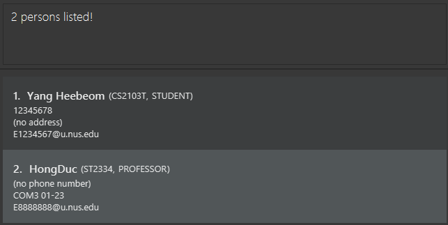
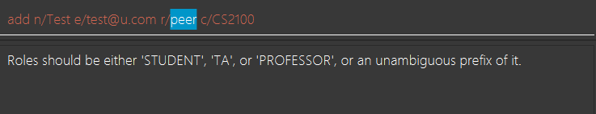

NUSContacts is a **desktop app designed for NUS Students, offering a streamlined way to manage their academic contacts with ease.**
Whether you're organizing peer groups, keeping track of tutors, or connecting with professors, NUSContacts centralizes the organization of contacts.

Our platform combines the simplicity of a Command Line Interface (CLI) with an intuitive Graphical User Interface (GUI), providing users with the best of both worlds.
If you can type fast, NUSContacts can get your contact management tasks done faster than traditional GUI apps.

--------------------------------------------------------------------------------------------------------------------
## Table of Contents

* Table of Contents
{:toc}

--------------------------------------------------------------------------------------------------------------------

## Quick start

1. Ensure you have Java `11` or above installed in your Computer. (Refer to [FAQ](#faq) on how to check your Java version and how to install it)

2. Download the latest `NUSContacts.jar` from [here](https://github.com/AY2324S2-CS2103T-T11-2/tp/releases).

3. Copy the file to the folder you want to use as the _home folder_ for your NUSContacts application.

4. Open a command terminal, `cd` into the folder you put the jar file in, and use the `java -jar NUSContacts.jar` command to run the application.<br>
   A GUI similar to the below should appear in a few seconds. Note how the app contains some sample data.<br>
   

5. Type the command in the command box and press Enter to execute it. e.g. typing **`help`** and pressing Enter will open the help window.<br>
   Some example commands you can try:

   * `list`: Lists all contacts.

   * `add n/John Doe p/98765432 e/johnd@example.com r/STUDENT a/PGPR c/CS2103T`: Adds a contact named `John Doe` to the Address Book.

   * `delete 3`: Deletes the 3rd contact shown in the current list.

   * `clear`: Deletes all contacts.

   * `exit`: Exits the app.

6. Refer to the [list of all commands](#list-of-all-commands) below for details of each command.

[Back to Table of Contents](#table-of-contents)

--------------------------------------------------------------------------------------------------------------------

## Features

### General features

#### Command history

You can navigate between past successful commands and the current command by pressing the `UP` and `DOWN` arrow keys.

#### Saving the data

NUSContacts data are saved in the hard disk automatically after any command that changes the data. There is no need to save manually.

[Back to Table of Contents](#table-of-contents)

--------------------------------------------------------------------------------------------------------------------

#### Editing the data file

NUSContacts data are saved automatically as a JSON file `[JAR file location]/data/nuscontacts.json`. Advanced users are welcome to update data directly by editing that data file.

You should only modify the data file when the program is closed, otherwise there is a risk of data loss as the program may not detect the changes.

<div markdown="span" class="alert alert-warning">:exclamation: **Caution:**
If your changes to the data file makes its format invalid, NUSContacts will discard all data and start with an empty data file at the next run. Hence, it is recommended to take a backup of the file before editing it.<br>
Furthermore, certain edits can cause the NUSContacts to behave in unexpected ways (e.g., if a value entered is outside the acceptable range). Therefore, edit the data file only if you are confident that you can update it correctly.
</div>

[Back to Table of Contents](#table-of-contents)

--------------------------------------------------------------------------------------------------------------------

### List of all commands

<div markdown="block" class="alert alert-info">

**:information_source: Notes about the command format:**<br>

* Words in `UPPER_CASE` are the parameters to be supplied by the user.<br>
  e.g. in `add n/NAME`, `NAME` is a parameter which can be used as `add n/John Doe`.

* Items in square brackets are optional.<br>
  e.g. `n/NAME [t/TAG]` can be used as `n/John Doe t/friend` or as `n/John Doe`.

* Items with `…` after them can be used multiple times including zero times.<br>
  e.g. `[t/TAG]…` can be used as ` ` (i.e. 0 times), `t/friend`, `t/friend t/owes money` etc.

  A standalone `…` has its usual meaning ("and so on"), to be interpreted depending on the surrounding context.

* If the command you have typed is an [unambiguous prefix](#term-unambiguous-prefix) of only one existing command, it will be interpreted as that existing command.<br>
  e.g. if the command is `ad …`, then it will be interpreted as an `add …` command.

* Parameters can be in any order, except specified otherwise.<br>
  e.g. if the command specifies `n/NAME p/PHONE`, `p/PHONE n/NAME` is also acceptable.

* For commands that do not take in parameters (such as `help`, `list`, `exit` and `clear`), specifying any extraneous parameters for them
  will result in an `Invalid command format!` error message. Make sure to just enter these commands as it is. 

* If you are using a PDF version of this document, be careful when copying and pasting commands that span multiple lines as space characters surrounding line-breaks may be omitted when copied over to the application.

* The command name and tag is case-sensitive, following tradition of `bash` shell commands.
  Nevertheless, all command names are in lowercase, and typing lowercase characters is faster than typing uppercase
  characters.
</div>

[Back to Table of Contents](#table-of-contents)

--------------------------------------------------------------------------------------------------------------------

#### Viewing help: `help`

Shows a message listing out all the available commands and their purpose.

Format: `help`

For more information regarding the command formats and examples, press `F1` to open up a help window (as shown in the picture below).
Depends on your keyboard model, you might have to press other keyboard combinations, such as `Fn+F1`, to trigger `F1`.

To close the help window, you can simply press `esc` on your keyboard. Windows users may also use 
`alt`+`F4` or click on the `X` in the top right corner of the window.


The [project website](https://ay2324s2-cs2103t-t11-2.github.io/tp/) includes the NUSContacts user guide, which contains a more detailed description of each command.

[Back to Table of Contents](#table-of-contents)

--------------------------------------------------------------------------------------------------------------------

#### Adding a contact: `add`

Adds a contact to the address book.

Format: `add n/NAME e/EMAIL r/ROLE c/COURSE [a/ADDRESS] [p/PHONE] [t/TAG]… [f/]`

<div markdown="span" class="alert alert-primary">:bulb: **Tip:**
A contact can have any number of tags (including 0).
</div>

Examples:
* `add n/John Doe p/98765432 e/johnd@example.com r/student a/PGPR c/CS2101`
* `add n/Betsy Crowe t/friend e/betsycrowe@example.com r/TA a/COM2-0102 c/ST2334`

This is mostly sufficient for you to know how to use the command. Here are some more details:

| Field | Description                                                                                                                                                                                                                                                                                                                      | Example                | Optional |
|-------|----------------------------------------------------------------------------------------------------------------------------------------------------------------------------------------------------------------------------------------------------------------------------------------------------------------------------------|------------------------|----------|
| `n/NAME` | Name of the contact.                                                                                                                                                                                                                                                                                                             | `n/John Doe`           | No |
| `e/EMAIL` | Email of the contact.                                                                                                                                                                                                                                                                                                            | `e/e0123456@u.nus.edu` | No |
| `r/ROLE` | Role of the contact. The allowed roles are `Student`, `TA`, and `Professor`. The input is case-insensitive, and you can type an [unambiguous prefix](#term-unambiguous-prefix) to specify the role.                                                                                                                                                          | `r/Student`, `r/s`      | No |
| `c/COURSE` | Course of the contact.                                                                                                                                                                                                                                                                                                           | `c/CS2103T`            | No |
| `a/ADDRESS` | Address of the contact. You may keep a professor or TA's office address here. However, TAs and students may not have an office, thus address is optional for these roles.                                                                                                                                                        | `a/PGPR`               | Yes |
| `p/PHONE` | Phone number of the contact. Unlike the `edit` command, `p/` without any phone number is not supported. If you want to not specify the phone number, leave out `p/PHONE` entirely.                                                                                                                                               | `p/98765432`           | Yes |
| `t/TAG` | Tags of the contact. The tag must not be empty. For the `add` command, if you want to not include any tag, leave out `t/TAG` entirely.                                                                                                                                                                                         | `t/friend`             | Yes |
| `f/` | Bypasses validation. The program will inform you if you violate a validation rule, and how to bypass it. More details in [technical details section](#detail-bypassing-validation).  | `f/`                   | Yes |


<div markdown="span" class="alert alert-warning">:exclamation:
  One `f/` bypasses all invalid field value errors.
  For example, `add f/ n/Alice e/ c/` bypasses to have empty email and course.
</div>

<div markdown="span" class="alert alert-primary">:bulb: **Tip:**
If you want to add people with same name, you can add additional characters to add and differentiate them.
For example, you can add two Alice by `n/Alice1` and `n/Alice2`.
</div>

[Back to Table of Contents](#table-of-contents)

--------------------------------------------------------------------------------------------------------------------

#### Editing a contact: `edit`

Edits an existing contact in the address book.

Format: `edit INDEX [n/NAME] [p/PHONE] [e/EMAIL] [r/ROLE] [a/ADDRESS] [c/COURSE] [t/TAG]… [f/]`

* Edits the contact at the specified `INDEX`. The index refers to the index number shown in the displayed address book. The index **must be a positive integer** 1, 2, 3, …
* At least one of the optional fields must be provided.
* Existing values will be updated to the input values.

* When editing tags, the existing tags of the contact will be removed i.e. adding of tags is not cumulative.
* You can remove the information in the optional fields.
  - You can remove a contact's address by typing `a/` without specifying any address after it.  
    But if the contact's role is `Professor` you can't remove the address.
  - You can remove all the contact’s tags by typing `t/` without
    specifying any tags after it.
  - You can remove a contact's phone number by typing `p/` without specifying any phone number after it.

Examples:
*  `edit 1 p/91234567 e/johndoe@example.com` Edits the phone number and email address of the 1st contact to be `91234567` and `johndoe@example.com` respectively.
*  `edit 2 n/Betsy Crower t/` Edits the name of the 2nd contact to be `Betsy Crower` and clears all existing tags.
*  `edit 3 p/ a/` Deletes the phone number and the address of the 3rd contact.

<div markdown="block" class="alert alert-info">
:bulb: If an invalid field value is specified, the program will inform you of the error.
You can fix the error, or use `f/` to bypass it if you want to.

Refer to [Adding a contact: `add`](#adding-a-contact-add) for more information about `f/`.
</div>

[Back to Table of Contents](#table-of-contents)

--------------------------------------------------------------------------------------------------------------------

#### Locating contacts: `find`

Finds contacts whose name, course or role contain any of the given keywords.

Format: `find KEYWORD [MORE_KEYWORDS]`

* The search is case-insensitive.  
  e.g `hans` will match `Hans`, `cs2103t` will match `CS2103T`, `student` will match `STUDENT`.
* The order of the keywords does not matter. e.g. `Hans Bo` will match `Bo Hans`.
* Only the name, course and role are searched.
* Only full words will be matched.  
  e.g. `Han` will not match `Hans`.  
  e.g. `cs2103` will not match `CS2103T`.  
  e.g. `stu` will not match `STUDENT`.
* Contacts matching at least one keyword will be returned (i.e. `OR` search).  
  e.g. `Hans Bo` will return `Hans Gruber`, `Bo Yang`.  
  e.g. `Hans CS2103T` will return `Hans Gruber`, `Bo Yang` whose course is CS2103T.  
  e.g. `Hans TA` will return `Hans Gruber`, `Bo Yang` whose role is TA.
  

Examples:
* `find John` returns `john` and `John Doe`.

* `find yang timothy` returns `Yang Heebeom`, `Timothy`.<br>
  

* `find yang cs2109s` returns `Yang Heebeom`, `Reet`.<br>
  

* `find yang professor` returns `Yang Heebeom`, `HongDuc`.<br>
    

##### Note on returning to the original view
{:.no_toc}
* After using `find`, the list may no longer display all saved contacts. Use `list` to revert the list to the full list of contacts in the order they were added.

[Back to Table of Contents](#table-of-contents)

--------------------------------------------------------------------------------------------------------------------

#### Listing all contacts: `list`

Shows a list of all contacts in the address book.

Format: `list`

<div markdown="block" class="alert alert-info">
:bulb: See [note](#note-on-returning-to-the-original-view) under [Locating Contacts](#locating-contacts-find) to understand how the `list` command can be useful.
</div>

[Back to Table of Contents](#table-of-contents)

--------------------------------------------------------------------------------------------------------------------

#### Deleting a contact: `delete`

Deletes the specified contact(s) from the address book.

Format: `delete INDEX`

* Deletes the contact at the specified `INDEX`.
* The index refers to the index number shown in the displayed address book.
* The index **must be a positive integer** 1, 2, 3, …

Examples:
* `list` followed by `delete 2` deletes the 2nd contact in the address book.
* `find Betsy` followed by `delete 1` deletes the 1st contact in the results of the `find` command.


You can also delete multiple contacts by chaining the indices using a comma.

Format: `delete INDEX1, INDEX2, INDEX3, …`

* A comma (`,`) must be used to separate each pair of indices.
* The indices do not need to be listed in order. (i.e. `2, 4, 6` is the same as `6, 2, 4`)
* Listing the same index more than once will result in an error message being displayed.
* Each `INDEX` must still adhere to the points listed above.
* Whitespace between indices is not important. i.e. `delete 1,2,3` is the same as `delete 1, 2, 3`.

Example:
* `delete 3, 1, 7, 8` deletes the first, third, seventh, and eighth contact in the address book.

[Back to Table of Contents](#table-of-contents)

--------------------------------------------------------------------------------------------------------------------

#### Copying a contact's email to clipboard: `copy`

Copies the email of the specified contact from the address book to the system clipboard.

Format: `copy INDEX`

* Copies the email of the contact at the specified `INDEX`.
* The index refers to the index number shown in the displayed address book.
* The index **must be a positive integer** 1, 2, 3, …

Examples:
* `list` followed by `copy 2` copies the email of the 2nd contact in the address book to the clipboard.
* `find Betsy` followed by `copy 1` copies the email of the 1st contact in the results of the `find` command to the clipboard.

[Back to Table of Contents](#table-of-contents)

--------------------------------------------------------------------------------------------------------------------

#### Clearing all entries: `clear`

Clears all entries from the address book.

Format: `clear`

[Back to Table of Contents](#table-of-contents)

--------------------------------------------------------------------------------------------------------------------

#### Undoing the last command: `undo`

Revert the last change to the address book.

Since you can only undo the most recent change, entering `undo` consecutively
will only show an error message (`No new changes has been made to the data`).
Likewise, entering `undo` with no prior changes will also display the same error message.

**Note:** `undo` does not affect commands that do not modify the address book
(`help`, `list`, `find` etc.). 

<div markdown="span" class="alert alert-primary">:bulb: **Tip:**
While it's not possible to redo (undo an undo), you can use the [command history](#command-history) feature,
press `UP` a few times to go to the command that executes the edit,
then press `ENTER` to execute it.
</div>

[Back to Table of Contents](#table-of-contents)

--------------------------------------------------------------------------------------------------------------------

#### Exiting the program: `exit`

Exits the program.

Format: `exit`

### Miscellaneous features

You don't need to know about these features on the first read.

#### Highlighting erroneous part of the command

When a command contains an error, the program will try to detect the part of the command that causes the error, and
selects it in the command box.

For example:
* If you type `peer` for the role field, the error message is shown and 
  the text cursor is positioned at `peer` where the error occurs as the image below.<br>
  

[Back to Table of Contents](#table-of-contents)

--------------------------------------------------------------------------------------------------------------------

#### Escape special characters

Naturally, because `n/` denotes the name, it is not possible to include it into part of many commands.
If you want to, you need to escape the slash `/`.

For example:

* If you want to edit the first contact to have a tag with content `info = n/a`, the following is incorrect:

    ```
    edit 1 t/info = n/a
    ```

    since `n/a` will be interpreted as editing the name of the first contact to `a`.

    Instead, you use a backslash to escape the slash as follows:

    ```
    edit 1 t/info = n\/a
    ```

* How can you escape a backslash? By using another backslash (the following will add a tag with content
    `included in people \ students`):
    ```
    edit 1 t/included in people \\ students
    ```

    Other characters should not be escaped.

* Here are more examples.

    | If you want to enter | You should type |
    |--|--|
    | `a/b` | `a\/b` |
    | `a\/b` | `a\\\/b` |
    | `a\\b` | `a\\\\b` |

* You should not enter [invalid escape sequences](#term-escaped-string), but if you do, the program will make a guess on what you mean.

    | If you type | The program will guess you wanted to type |
    |--|--|
    | `a\\\b` | `a\\\\b` |
    | `x/y` | `x\/y` |

* Here are some example commands.

  * `add n/John s\/o Doe p/98765432 e/johnd@example.com r/student a/PGPR c/CS2103T` will add a contact with name
    `John s/o Doe`.
  * `find John s\/o Doe` will be able to find that person.
  * `edit 2 t/birthday: 3\/2` will edit the tag list of the 2nd person to have a single tag `birthday: 3/2`.

[Back to Table of Contents](#table-of-contents)

--------------------------------------------------------------------------------------------------------------------

## Appendix: Technical details

You should not need to read this, unless you run into some trouble.

### Detail: Bypassing validation

Several fields have some validation rules (for example, you cannot have email address with parentheses as there are no emails with parentheses).
However, sometimes you might want to have the input that doesn't strictly adhere to these rules. For example, you may want to input both official and personal email addresses for a single person in an email field, like `E11111111@u.nus.com(school), helloworld@gmail.com(personal)`.
To accommodate such cases, the program allows users to bypass the validation rules by appending `f/` to the end of their input. So, if you wanted to change 7th person's email address to the above email addresses despite the parentheses, you could do so by `edit 7 e/E11111111@u.nus.com(school), helloworld@gmail.com(personal) f/`.

Some validation rules cannot be bypassed, however. If an error can be bypassed, the program will instruct you how to
bypass it (by appending `f/` at the end of the command).

Note that `f/` must come at the end, or immediately before a tag.
For example, `add f/ n/Alice e/alice@gmail.com r/STUDENT c/CS2103T` is allowed, but `add n/ f/ Alice …` or `add n/Alice e/ f/alice@gmail.com` is not allowed.

[Back to Table of Contents](#table-of-contents)

--------------------------------------------------------------------------------------------------------------------

### Term: Escaped string

In the "[Escape special characters](#escape-special-characters)" feature, sometimes it's needed to *escape* a string in
order to enter it into the program.

Given a string `s`, **in order to escape it, the following procedure should be followed**:
For each character of `s`, if it is `/` or `\`, prepend a backslash `\` before it.

A valid **escaped string** is a string that is a possible result from applying the procedure above.
Equivalently, a valid escaped string is a sequence of zero or more of the following:
* Any character that is neither `/` nor `\`,
* The string `\/` or `\\`.

For example, `a\\b` is a valid escaped string that would result from escaping the string `a\b`. However, `a\x41b` would
be an invalid escaped string.

[Back to Table of Contents](#table-of-contents)

--------------------------------------------------------------------------------------------------------------------

### Term: Unambiguous prefix

In several places in the program, you can type a prefix of the string to abbreviate the string.

For example, you can type `a` to abbreviate [the `add` command](#adding-a-contact-add).

A string `s` is a **prefix** of another string `t` if `s` can be obtained by removing zero or more characters at the end
of `t`. For example, "ab" is a prefix of "abcd", but it's not a prefix of "acbd".

A prefix for a command is **unambiguous** if there is exactly one command that it is a prefix of,
and a prefix is **ambiguous** if there are at least two commands it is a prefix of.
For example, since there are two commands `edit` and `exit`, the string "e" would be an **ambiguous** prefix, since it
is a prefix of two distinct commands.

Similarly, a prefix for a role is unambiguous if there is exactly one role that it is a prefix of.
Because currently there are only 3 roles (Student, Professor, TA), there is no ambiguous prefix for roles.

[Back to Table of Contents](#table-of-contents)

--------------------------------------------------------------------------------------------------------------------

## FAQ

**Q**: How do I know if I have Java 11?<br>
**A**: Open your command terminal and enter `java --version`. The first line displayed should show `java` immediately followed by the version number.

**Q**: How do I install Java 11?<br>
**A**: Download Java 11 JRE [here](https://adoptium.net/temurin/releases/?package=jre&version=11). Then follow their [installation guide](https://adoptium.net/installation/).

**Q**: How do I transfer my data to another Computer?<br>
**A**: Install the app in the other computer and overwrite the empty data file it creates with the file that contains the data of your previous NUSContacts home folder.

**Q**: How do I include special characters such as `/` into the name, address or tag?<br>
**A**: Refer to ["Escape special characters" section](#escape-special-characters).

**Q**: I've found a bug in the application. How can I report it?<br>
**A**: Please check the [list of known issues/limitations](#known-issueslimitations) first. If it is not covered, you can report the bug at the [project's issue tracker on GitHub](https://github.com/AY2324S2-CS2103T-T11-2/tp/issues).

[Back to Table of Contents](#table-of-contents)

--------------------------------------------------------------------------------------------------------------------

## Known issues/limitations

1. **When using multiple screens**, if you move the application to a secondary screen, and later switch to using only the primary screen, the GUI will open off-screen. The remedy is to delete the `preferences.json` file created by the application before running the application again.

2. **A professor must have an address attached**. This is reasonable in most cases; however, some visiting
   instructor may not have a specific office address in NUS.

   Because address can be any nonempty string, you can work around this issue by typing "`none`" or similar into the address field.
   The program will not handle this input specially, however.

1. If any component (name, email, etc.) is too long, **it will be hidden on the screen**.

8. The result display cannot be resized to view the text in case the text is long.

3. The `undo` only supports undoing one command, as mentioned in [the command's
   documentation](#undoing-the-last-command-undo).

4. Using the `edit` command to edit the tag list will delete all the existing tags and replace it with the
   new tags, as mentioned in [the command's documentation](#editing-a-contact-edit).

5. There's no way to make [the `find` command](#locating-contacts-find) more targeted; for example, if there are 3 entries in the address book with name `John Doe`, `Jane Doe` and `John Smith`, then there's no way to search for specifically `John Doe`.  <!-- ] -->

7. Duplicate phone number and email are not detected.

[Back to Table of Contents](#table-of-contents)

--------------------------------------------------------------------------------------------------------------------

## Command summary

| Action     | Format, Examples                                                                                                                                                         |
|------------|--------------------------------------------------------------------------------------------------------------------------------------------------------------------------|
| [**Add**](#adding-a-contact-add)    | `add n/NAME e/EMAIL r/ROLE c/COURSE [a/ADDRESS] [p/PHONE] [t/TAG]… [f/]` <br> e.g., `add n/James Ho p/22224444 e/jamesho@example.com r/STUDENT a/PGPR c/CS2103T t/friend` |
| [**Clear**](#clearing-all-entries-clear)  | `clear`                                                                                                                                                                  |
| [**Delete**](#deleting-a-contact-delete) | `delete INDEX`<br> e.g., `delete 3`                                                                                                                                      |
| [**Edit**](#editing-a-contact-edit)   | `edit INDEX [n/NAME] [p/PHONE] [e/EMAIL] [r/ROLE] [a/ADDRESS] [c/COURSE] [t/TAG]…`<br> e.g.,`edit 2 n/James Lee e/jameslee@example.com`                                  |
| [**Find**](#locating-contacts-find)   | `find KEYWORD [MORE_KEYWORDS]`<br> e.g., `find James Jake CS2103T STUDENT`                                                                                               |
| [**List**](#listing-all-contacts-list)   | `list`                                                                                                                                                                   |
| [**Help**](#viewing-help-help)   | `help`                                                                                                                                                                   |
| [**Exit**](#exiting-the-program-exit)   | `exit`                                                                                                                                                                   |
| [**Copy Email**](#copying-a-contacts-email-to-clipboard-copy)   | `copy INDEX`                                                                                                                                                             |
| [**Undo**](#undoing-the-last-command-undo)   | `undo`                                                                                                                                                                   |

[Back to Table of Contents](#table-of-contents)

--------------------------------------------------------------------------------------------------------------------
